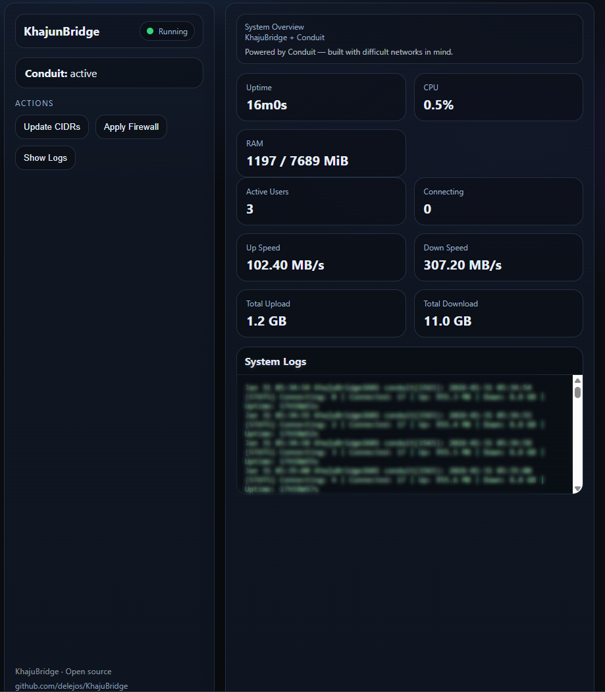

# KhajuBridge Web Console

A lightweight, LAN-only web interface for KhajuBridge and Conduit.

This console provides a minimal dashboard for monitoring system health,
Conduit activity, and applying firewall updates.

It is optional and not required to use KhajuBridge.

---

## Design Goals

- Single static Go binary
- No database
- No JavaScript frameworks
- Environment-based configuration
- Safe defaults (LAN-only access)
- Suitable for constrained or sensitive networks

---

## Features

- System overview (uptime, CPU, memory)
- Live Conduit statistics (connections, throughput)
- Region CIDR update and firewall apply actions
- Live Conduit logs via `journalctl`

---

## Screenshot





## Configuration

The console is configured via an environment file:

/etc/khajubridge/console.env


Example:

```env
LISTEN_ADDR=:8081

# Path to KhajuBridge scripts
KHAJUBRIDGE_SCRIPTS=/opt/khajubridge/scripts

# systemd unit name for Conduit
CONDUIT_UNIT=conduit.service

# How many journal lines to read
JOURNAL_TAIL=200

# Allowed client CIDRs (comma-separated)
ALLOW_CIDRS=127.0.0.1/32,10.0.0.0/8,172.16.0.0/12,192.168.0.0/16
```
## Security Notes
The console is intended for trusted networks only

Access is restricted by a CIDR allowlist

Commands are executed via tightly scoped sudo rules

No authentication is implemented by design

## Philosophy
Powered by Conduit — built with difficult networks in mind.

The console intentionally avoids complexity, persistent state,
and external dependencies. It is designed to remain understandable,
auditable, and easy to remove.

## Status
This console is intentionally simple and stable.

It is not meant to be a general-purpose management interface.